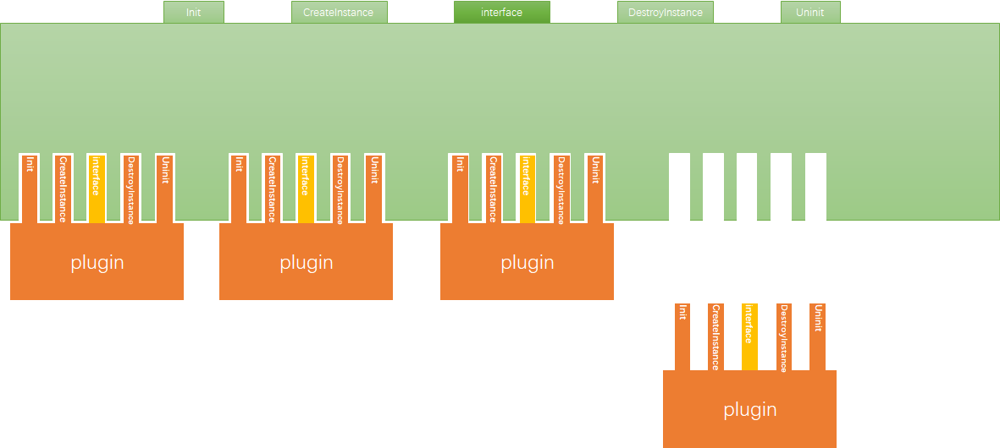

<p align="center">
  
</p>

# 1.介绍

[](./LICENSE.txt)
[](./doc)
[](./README.md)

gplug（通用插件管理库）是一个通用的插件管理库。

gplug用于统一管理应用程序中的插件。它负责加载、初始化、取消初始化和卸载插件，并支持在运行时添加和删除插件。

通用插件管理器模仿COM(Component Object Model)组件的设计思想，将调用方和插件分割开，调用方和插件直接通过接口通讯。调用方通过插件管理器接口获取插件功能接口，然后可以直接与插件交互。




# 2.基本组成

gplug有三个主要部分：插件、插件管理器和插件配置文件。

## Plugin

每个插件都由一个唯一的ID（file key）标识，插件必须实现一个符合插件规范的接口。仿照微软COM中使用GUID来标识COM组件。

## Plugin configuration file

插件管理器使用配置文件以统一的方式管理插件。配置文件包含FileKey、延迟加载等参数。

[这里](./docs/markdown/ConfigFile.md)是对插件配置文件的详细说明。

## Plugin Manager

插件管理器根据文件ID（FileKey）初始化相应的插件，对外提供了创建插件实例、销毁插件实例、根据接口ID（InterfaceKey）获取插件支持的函数接口等功能。

# 3.接口

接口分为两部分，插件管理器接口和插件规范接口。

插件需要实现插件接口，应用程序调用插件管理器接口来实现插件管理。

[这里](./docs/markdown/Interface.md)是对接口的详细说明。gplug文档可以使用[Doxygen]生成(http://www.doxygen.org/)。

# 4.开发步骤

开发过程如下：

>定义插件功能接口
>        ↓ 
>实现插件功能接口
>        ↓ 
>导出插件统一接口
>        ↓ 
>创建配置文件
>        ↓ 
>使用PlugMgr接口调用Plugin函数接口

[这是](./docs/markdown/1.DevelopmentProcess/README.md)根据流程开发插件的示例。

# 5.例子

更多示例请看 [这里](./example/README.md).


# 6.编译


1. 克隆仓库

```shell
git clone https://gitee.com/QWorkShop/gplug.git
```

2. 生成必要的构建文件

   在此步骤中，将克隆第三方库。

```cmake
cd EVHttpServer
cmake -B build -S . -DCMAKE_INSTALL_PREFIX=/path/to/install -DCMAKE_BUILD_TYPE=Release
```

3. 编译源代码。在此步骤中，将编译第三方库、gplug库、示例和测试。

```cmake
cmake --build build
```

4. 安装

```cmake
cmake --install build
```

现在，您可以使用gplug库了，在代码中包含头文件，在编译时链接gplug库。

# 7.其他

插件管理器目前无法解决不同的插件的依赖库的版本冲突问题。

