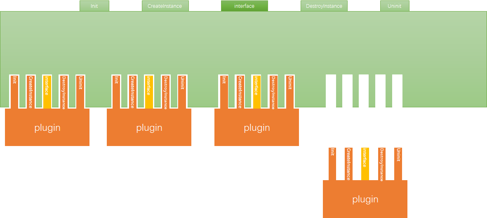
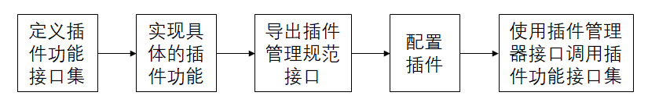

# 1.概述

gplug (general plugin management library)是一个通用插件管理库。

gplug 用于统一管理应用程序中的插件，负责加载、初始化、反初始化和卸载各个插件，并支持在运行时添加和删除插件库。

gplug 被设计成将插件接口和用户功能接口分开。插件管理器通过插件规范接口获取插件功能接口，然后就可以直接与插件进行交互。

在gplug中主要有三部分：插件、插件管理器、插件配置文件。

## 插件

每个插件使用唯一的ID（file key）进行标识，插件必须实现符合插件规范接口。

## 插件配置文件

插件管理器采用配置文件的方式对插件进行统一管理，配置文件中有插件的ID和是否延迟加载等参数。

## 插件管理器

插件管理器根据文件ID（FileKey）对相应的插件进行初始化，根据功能ID(InterfaceKey)获取插件功能接口函数的指针并调用不同插件的功能接口等。

# 2.接口

gplug documentation is generated using  [Doxygen](http://www.doxygen.org/).

接口分为两部分，分为插件管理器接口和插件规范接口。

插件要实现插件接口，应用程序调用插件管理器接口实现插件管理。

# 3.Development steps

插件的开发和使用流程如下：

[这里](./docs/2.开发流程/README.md)是按照流程开发开发插件的一个示例。

# 4.示例

Check out examples [here](./example/README.md)

# 5.编译

# 6.局限性

gplug目前无法解决不同的插件库所依赖的库的版本冲突问题。

